# 使用手册

本手册面向使用SPI上位机的用户，旨在提供完整的软件介绍和操作指导。通过阅读本手册，用户将能够快速掌握程序内的基本功能。

## 1 界面介绍

### 主页面

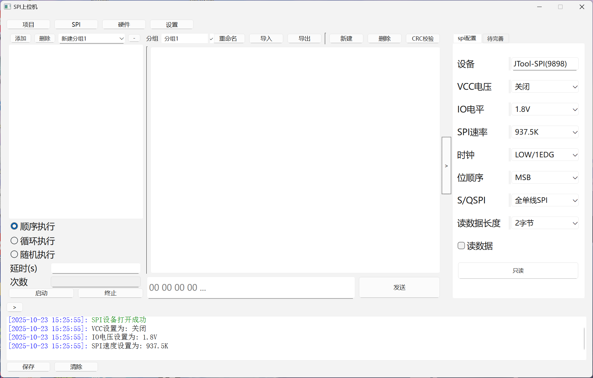

<small><b>图1.1 软件主页面</b></small>

软件主页面包含四大区域：

- 日志区域
- 数据管理与发送区域
- 配置区域

用户可通过软件上方的切换按钮切换不同页面。主页面为SPI页面，其他页面包括项目页面、硬件页面、设置页面。软件主页面详细功能将在**功能详解介绍**。

### 项目页面

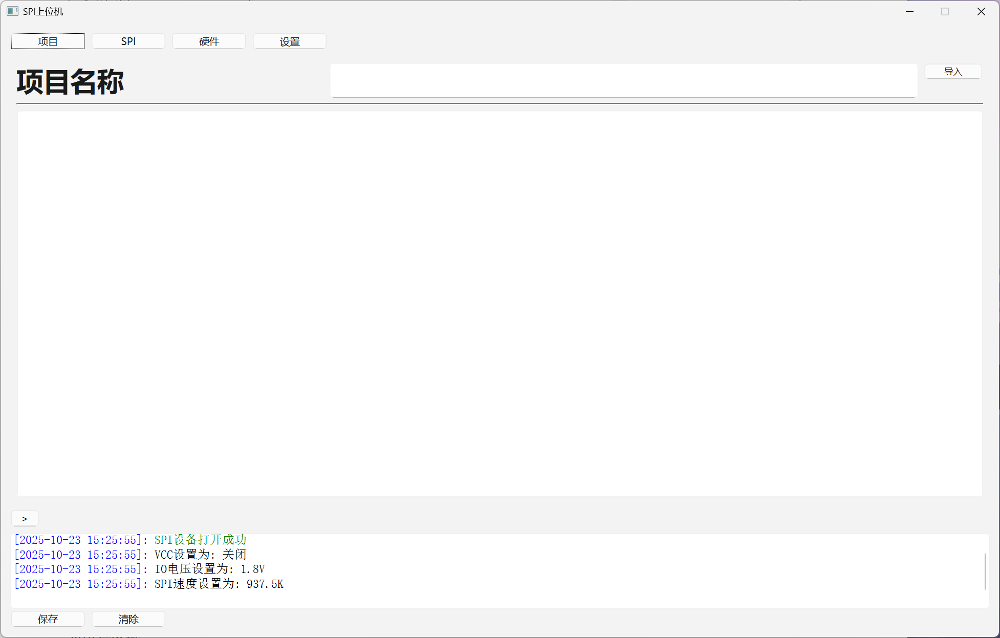

<small><b>图1.2 软件项目页面</b></small>

用户可通过项目页面导入项目文件夹（**project_config**），配置此页面及主页面中的数据管理与发送区域及配置区域。**导入的文件夹命名和以下目录保持一致**，**project_config**的目录如下：

```
project_config/
├── top.yml             # 项目顶层配置文件，命名必须为top.yml
├── group/
│   ├── test1.yml       # 数据组1配置
│   └── test2.yml       # 数据组2配置
|   └── ·····
└── markdown/
    ├── 示例.md          # 说明文档，支持图片导入，但图片缩放会有问题
    └── 示例.assets/
        └── png# 文档相关图片资源
```

top.yml的格式如下：

```yaml
"project_name": "SPI测试项目"             # 项目名称
"data_group_path":                       # 数据组配置文件路径
 - "project_config/group/test1.yml"
 - "project_config/group/test2.yml"
"markdown_path": "markdown/示例.md"       # 文档路径
```

数据组配置文件格式如下：

```yaml
"data_group_name": "分组1"                # 分组名称
"spi_config":                            # SPI配置，具体配置参考主页面配置区域的内容
  "vcc": "=IO"
  "io": "1.8V"
  "speed": "15M"
  "clk": "LOW/1EDG"
  "bit": "MSB"
  "s_or_q": "全单线SPI"
  "rx_size": "2字节"
"data_group":                             # 数据组
  - "name": "测试数据1"
    "data": "AA 11"
  - "name": "测试数据2"
    "data": "AA 22"
"mode_group":                             # 发送模式分组
  "新建分组1":
    - "name": "测试数据1"
      "data": "AA 11"
    - "name": "测试数据1"
      "data": "AA 11"
  "新建分组2":
    - "name": "测试数据2"
      "data": "AA 22"
    - "name": "测试数据2"
      "data": "AA 22"
```

**操作步骤**：点击项目页面导入按钮，导入project_config文件夹，即可成功导入。

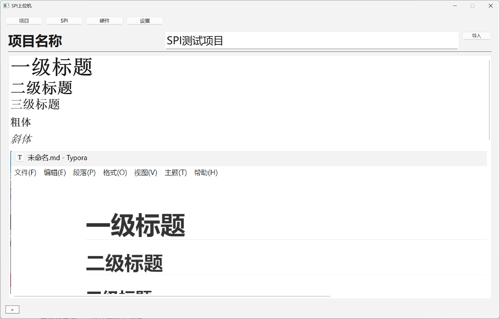

<small><b>图1.3 导入成功后项目页面</b></small>

导入文件夹后可实现数据组配置文件的实时保存，即对主页面中的数据、SPI配置进行操作，对应的yml文件中的内容会实时更改。不过此内容存在问题，会在**遗留问题**处介绍。

其余页面功能尚未完善，此暂不展示。

## 2 功能详解

此章节将向用户讲解SPI主页面三大区域的详细功能。依次介绍日志区域、数据管理发送区域、配置区域

### 2.1 日志区域

**功能概述**：
日志区域用于实时显示软件运行过程中的所有操作信息。

**界面组成**：
日志区域主要由以下三个部分组成：

- **日志显示框**：显示所有日志信息
- **保存按钮**：可将当前日志内容导出为 `.txt`文件
- **清除按钮**：清空日志显示区域内的所有信息（此操作设有二次确认以防误触）
- **折叠按钮**：可折叠日志框


<small><b>图2.1.1 日志区域整体界面</b></small>

#### 2.1.1 日志显示框

日志显示框会按时间顺序记录并展示软件的各类运行信息。

**信息颜色分类**

为便于快速识别，不同类型的信息可能会以不同颜色显示：

- **黑色/默认色**：普通信息、配置记录
- **绿色**：发送的数据、接收的数据、导入yml文件记录
-  **红色**：错误信息和警告

#### 2.1.2 日志保存功能

此功能允许用户将当前的日志内容保存到本地硬盘。

**操作步骤**：

1. 点击【保存】按钮
2. 系统将弹出“保存日志”对话框
3. 在对话框中选择目标文件夹，并可以为文件命名
4. 点击对话框中的【保存】按钮，即可完成保存

#### 2.1.3 日志清除功能

当日志内容过多，需要清理日志显示区域的所有信息，可以使用此功能。软件设计了二次确认机制，有效防止因误操作导致重要日志信息丢失。

**操作步骤**：

1. 点击【清除】按钮
2. 系统会立即弹出一个确认对话框，提示“**是否清除日志？**”
3. 如需继续清除：点击【OK】按钮，日志显示框内的内容将被立即并彻底清空
4. 如需保留日志：点击【Cancel】按钮，对话框将关闭，所有日志信息均保持不变

#### 2.1.4 日志折叠功能

单击日志显示框区域上方按钮【>】，可实现日志的折叠与展开。

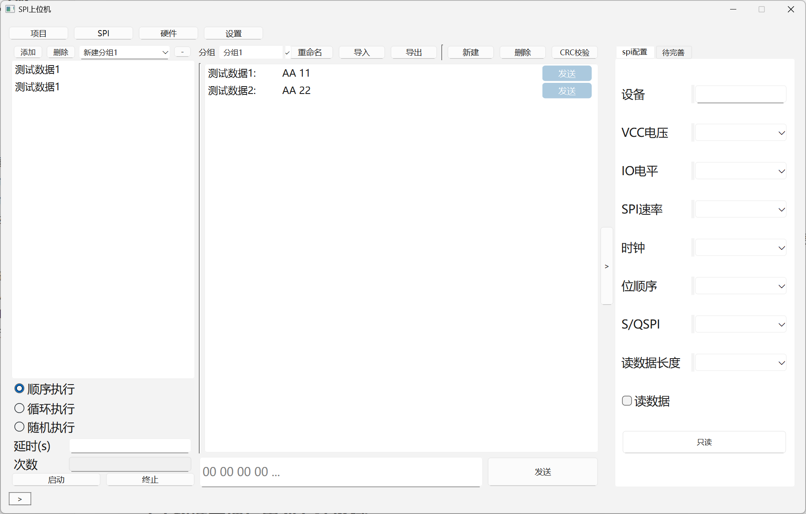

<small><b>图2.1.1 日志折叠后主界面</b></small>

### 2.2 数据管理发送区域

**功能概述**：
该区域用于管理待发送的数据组和模式分组，包括数据的创建、编辑、导入导出、执行模式发送操作、执行单次数据发送操作和直接发送

**界面组成**：
该区域主要由以下四个部分组成：

- **数据显示框**：以列表形式展示所有待发送的数据条目，可通过条目中的发送按钮发送当前条目

- **快速发送区**：通过单独按钮发送数据输入框中的单条数据

- **模式发送区**：与数据显示框联动实现模式发送功能

- **数据操作区**：提供数据组管理、模式分组管理、文件操作和校验设置功能

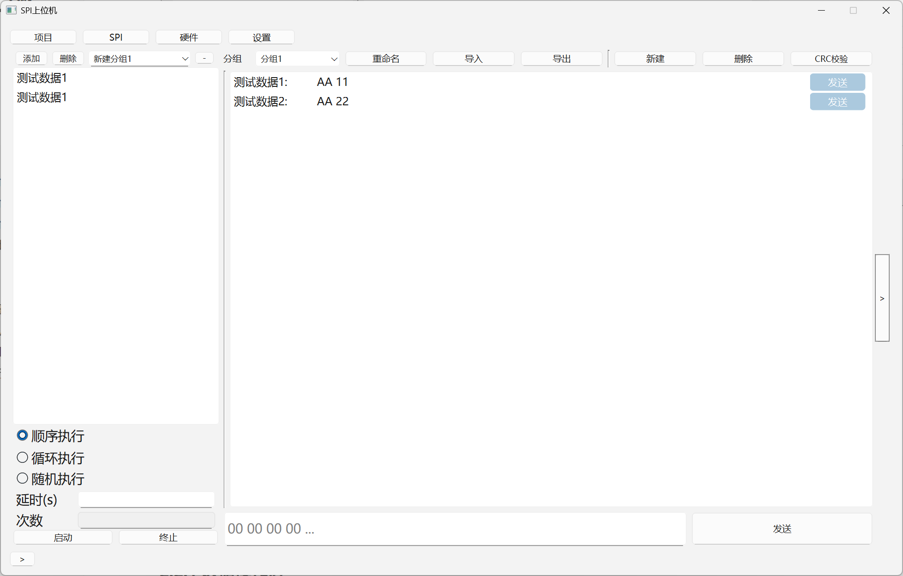

<small><b>图2.2.1 数据管理发送区域整体界面</b></small>

#### 2.2.1 数据显示区

数据显示框以的可视化方式呈现待发送数据。可操作数据，具体操作在数据操作区介绍。

**基本功能**：

- **列表显示**：展示所有已导入或新建的数据条目
- **拖拽排序**：长按数据条目，可拖动调整数据在列表中的顺序位置
- **直接发送**: 单击数据条目的发送按钮，可直接发送此数据

**CRC预览功能**：

- **触发条件**：选择CRC校验方式后
- **使用方法**：将鼠标悬停在数据条目上
- **显示内容**：提示加入CRC校验码后的完整数据


<small><b>图2.2.2 CRC预览功能</b></small>

#### 2.2.2 快速发送区

通过按钮向SPI设备发送数据输入框中的单条数据，发送的数据无严格格式要求。

**操作**：

1. 向数据输入框中输入待发送数据，SPI设备必须处于已连接状态
2. 点击【发送】按钮后，输入框中的数据将通过SPI接口发送
3. 发送状态和结果将在日志区域实时显示
4. 如启用CRC校验，系统会自动添加校验码后发送

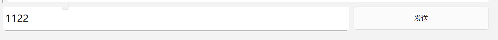

<small><b>图2.2.3 快速发送区整体界面</b></small>

#### 2.2.4 模式发送区

该区域支持三种自动化数据发送模式，可精确控制发送间隔（最低1ms精度）和发送次数、支持模式组内切换，切换不同的待发送模式组，满足不同的测试需求。可操作数据，具体操作在数据操作区介绍。

**通用配置项**：

- **发送间隔**：设置每条数据发送之间的时间延迟（单位：秒）
- **发送次数**：设置循环或随机模式的执行次数

**操作前提：**点击添加按钮，添加模式组，通过长按数据显示框中的数据，可将数据拖拽至模式发送区。

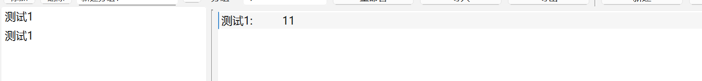

<small><b>图2.2.4 拖拽功能效果</b></small>

**顺序执行**

- **操作**：模式发送区存在数据，设置发送间隔，点击【启动】按钮
- **效果**：按照数据在列表中的顺序依次发送所有选中的数据，发送完成后自动停止，发送过程中可随时点击【终止】按钮，系统将在当前数据发送完成后停止
- **注意**：若未勾选任何数据或未设置发送间隔，系统将弹出提示框或在日志中记录错误信息

**循环执行**

- **操作**：模式发送区存在数据，设置发送间隔和循环次数，点击【启动】按钮
- **效果**：按照顺序循环发送所有选中的数据，遍历完所有选中数据计为一次循环，达到设定的循环次数后停止
- **示例**：如勾选3条数据，循环次数设为2，则发送顺序为：数据1→数据2→数据3→数据1→数据2→数据3

**顺序执行**

- **操作**：模式发送区存在数据，设置发送间隔和随机次数，点击【启动】按钮
- **效果**：从所有选中的数据中随机选择一条进行发送，达到设定的随机次数后停止

#### 2.2.4 数据操作区

数据操作区提供完整的数据管理功能，可由数据显示区和模式发送区分为两个方面：


<small><b>图2.2.5 数据操作区域整体界面</b></small>

##### 数据显示区的数据操作（数据显示区上方）

**组别名称显示**

- 显示当前数据组的名称，便于区分不同的数据组
- 若导入文件夹**project_config**，可通过下拉框切换不同的数据组，同时也会切换对应数据组配置文件中的发送模式分组

**组别名称重命名**

- **操作**：点击【重命名】按钮
- **效果**：弹出名称修改对话框，输入新名称后，组别显示将更新
- **注意**：在导入文件夹后

**导入YAML文件**

- **操作**：点击【导入】按钮
- **效果**：弹出文件选择对话框，选择符合格式的数据组配置文件。导入文件后会自动实时保存主页面的数据操作。注：导入**project_config**后请不要使用此功能，因为导入数据组配置文件时会清空之前主窗口中所有内容

- **文件格式要求**：

```yaml
"project_name": "分组1"          # 分组名称
"spi_config":                   # SPI配置
  "vcc": "关闭"
  "io": "1.8V"
  "speed": "937.5K"
  "clk": "LOW/1EDG"
  "bit": "MSB"
  "s_or_q": "全单线SPI"
  "rx_size": "2字节"
"data_list":                    # 数据组
  - "name": "数据名称1"
    "data": "数据内容1"
  - "name": "数据名称2" 
    "data": "数据内容2"
"mode_group":
  "新建分组1":
    - "name": "数据名称1"
      "data": "数据内容1"
    - "name": "数据名称2" 
      "data": "数据内容2"
```

**导出YAML文件**

- **操作**：点击【导出】按钮
- **效果**：将当前数据组的所有信息（包括组名、SPI配置、数据列表）导出为YAML文件

**新建单条数据**

- **操作**：点击【新建】按钮
- **效果**：打开SPI数据窗口
- **数据格式**：
	- **数据名称**：为待发送数据命名
	- **数据内容**：以十六进制格式输入，如 `00 12 A0 FF`
	- **格式规范**：每两个十六进制数表示一个字节，字节间用空格分隔
- **错误处理**：如输入格式不符合规范，系统会弹出错误提示并要求重新输入

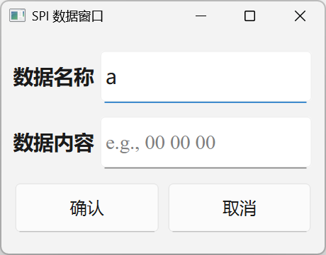

<small><b>图2.2.6 SPI数据窗口界面</b></small>

**删除选中数据**

- **操作**：点击【删除】按钮
- **效果**：删除当前选中的数据条目（数据条目为灰色）
- **安全机制**：设有二次确认对话框，防止误删除重要数据

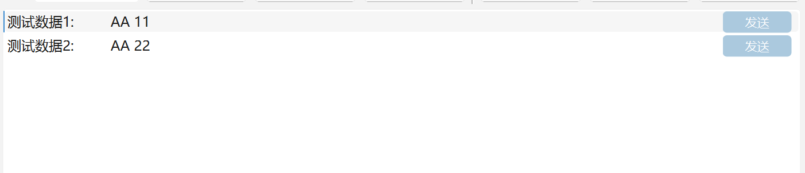

<small><b>图2.2.7 选中数据示例</b></small>

**CRC校验选项**

- **功能**：设置数据发送时的校验方式，现只支持写校验
- **当前选项**：无校验、CRC-16自定义校验
- **操作**：点击CRC按钮，弹出子窗口，勾选使能校验，点击确认，即可开启CRC校验

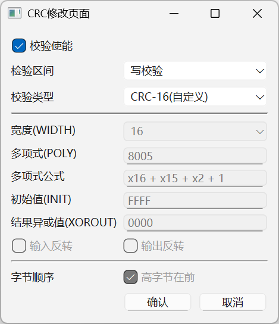

<small><b>图2.2.8 CRC子窗口</b></small>

##### 模式发送区的数据操作（模式发送区上方）

**添加模式组**

- **操作**：点击【添加】按钮
- **效果**：为模式发送区添加分组，可通过下拉框切换模式组

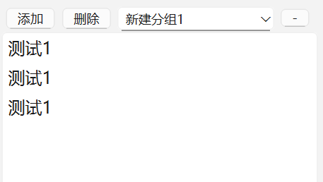

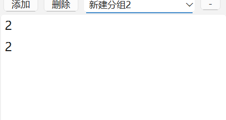

<small><b>图2.2.8 切换模式组预览</b></small>

**删除模式组**

- **操作**：点击【删除】按钮
- **效果**：删除分组，没提醒功能

**组别名称显示**

- **操作**：如果有多组模式组，可通过下拉框切换不同的模式组，可直接在下拉框更改名称
- **效果**：显示当前模式组的名称，便于区分不同的模式组

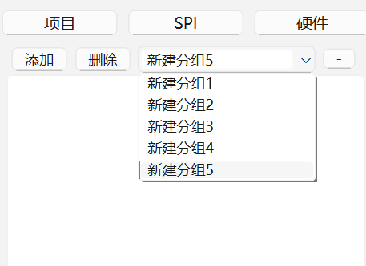

<small><b>图2.2.8 组别名称显示预览</b></small>

**删除数据**

- **操作**：与数据显示区域的操作一致，选中数据（数据条目为灰色），点击【-】按钮
- **效果**：删除数据，没提醒功能

### 2.3 配置区域

**功能概述**：
该区域用于配置SPI通信参数等其余配置内容，功能尚未完善，只介绍SPI配置

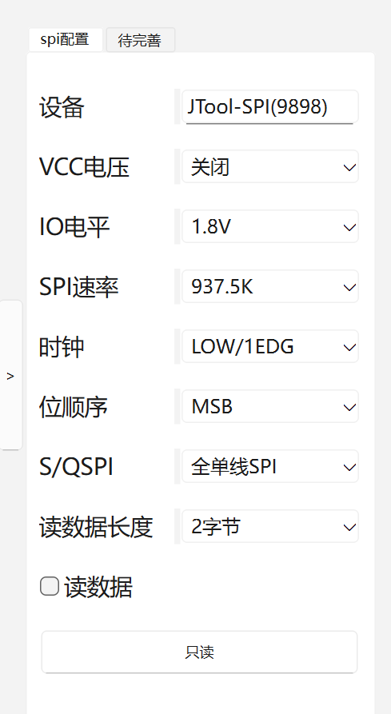

<small><b>图2.3.1 配置区域界面</b></small>

配置SPI设备的硬件参数，所有配置修改后立即生效。可通过按钮【>】收起配置区域，过滤信息。

**可配置信息**：

- **VCC电压**：设置VCC输出为5V、=IO、关闭
- **IO电平**：设置信号电平标准为3.3V、1.8V
- **SPI速率**：设置通信波特率为468.75K、937.5K、1.875M、3.75M、7.5M、15M、30M、60M
- **时钟**：设置时钟极性和相位为LOW/1EDG、LOW/2EDG、HIGH/1EDG、HIGH/2EDG
- **位顺序**：设置数据传输顺序为MSB、LSB
- **S/QSPI**：设置SPI模式为全单线SPI（四线/双线模式将在后续版本支持）
- **读数据长度**：设置读取操作的数据长度为2、4、8、16、32、64字节
- **读数据**：启用读取功能，点击按钮【只读】，开启读时序

### 3 遗留问题

说明：在导入项目文件夹（**project_config**）后，在**数据显示区**进行**组别名称重命名**，会导致问题：

1. **project_config**中实时更新的**数据组配置文件**出现错误，如：两个不同的**据组配置文件**实时更新为同样的内容
2. **模式发送区**不会随着**数据显示区**的下拉框切换不同的数据组，切换对应数据组配置文件中的发送模式分组。

可能原因：在Qt控件连接自动保存信号，此信号可能不稳定。在控件发生变化时：如数据添加、删除等，会导致自动保存信号多次触发。且实时更新功能需要时间延时，如果时间延时过短，无法写入yaml文件，时间延时过长，导致界面卡顿。

解决方法：请在导入项目文件夹（**project_config**）后，务必禁止**数据显示区**的数据操作（数据显示区上方）中的**组别名称重命名**。

### 4 错误码信息

SPI设备如果存在问题，调用的API会返回错误码信息。一般情况下会在日志区域显示具体的错误信息。但为了防止某些地方出现遗漏，现给出具体的错误码。

各个错误码信息如下：

- **错误码1**：参数错误
- **错误码2**：USB 断开
- **错误码4**：USB发送忙
- **错误码8**：正在等待回复
- **错误码16**：通信超时
- **错误码32**：通信数据错误
- **错误码64**：返回失败参数

若出现错误码，重新插拔SPI设备，使设备重新初始化即可解决。